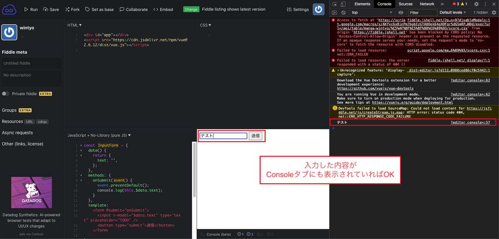
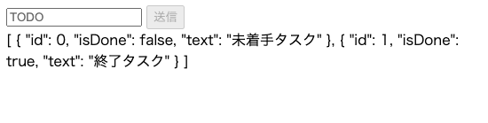
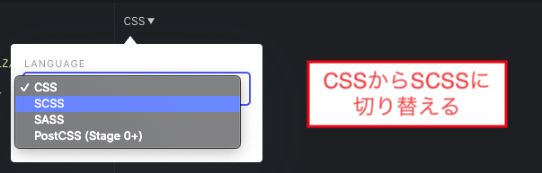
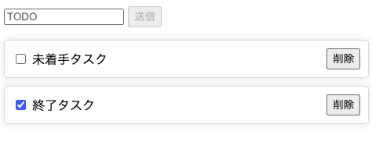

# TODOリストアプリを作る（Vue.js編）
この記事ではJSFiddleを使用して以下のようなアプリを作ります。

<iframe width="100%" height="300" src="//jsfiddle.net/wintyo/3zx8L49q/embedded/result,js,html,css/" allowfullscreen="allowfullscreen" allowpaymentrequest frameborder="0"></iframe>

## Vue.jsの起動準備
まずは以下のコードをそれぞれHTML, JSに入力してVue.jsが動く状態にします。

```html
<div id="app"></div>
<script src="https://cdn.jsdelivr.net/npm/vue@2.6.12/dist/vue.js"></script>
```

```js
new Vue({
  el: '#app',
  template: '<div>Hello Vue!</div>',
});
```

## 送信コンポーネントの作成
### 見た目の調整
次にTODOを送信するコンポーネントを作成します。
以下のように書き換えて、コンポーネントを呼べるようにしましょう。

```js
const InputForm = {
  template: `
    <div>InputForm Component</div>
  `
};

new Vue({
  el: '#app',
  components: {
    InputForm,
  },
  template: `
    <div>
      <InputForm/>
    </div>
  `
});
```

これを実行すると画面には「InputForm Component」が表示されます。InputFormという小さなコンポーネントを`components`キーで使用することを明記し、template内でそれをHTMLタグを同じように書くことで使用することができます。

これができるようになったら、あとはInputFormの表示を整えましょう。

```js
const InputForm = {
  template: `
    <form>
      <input type="text" placeholder="TODO" />
      <button type="submit">送信</button>
    </form>
  `
};
```

### 入力内容の取得とイベントのハンドリング
続いて入力データの取得と送信イベントのハンドリングをします。
入力データは`v-model`を使用してinputに書かれている内容をVue.jsのdataに格納し、formタグのsubmitのイベントを拾ってハンドリングをします。

```js
const InputForm = {
  data() {
    return {
      text: '',
    };
  },
  methods: {
    onSubmit(event) {
      event.preventDefault();
      console.log(this.$data.text);
    }
  },
  template: `
    <form @submit="onSubmit">
      <input v-model="$data.text" type="text" placeholder="TODO" />
      <button type="submit">送信</button>
    </form>
  `
};
```

送信ボタン、または入力フォームでEnterを押した際にWebコンソール上に入力した内容が出てきたらOKです。



:::tip $dataの省略
実は以下のように$dataを省略してもアクセスすることはできます。
しかし、Vue.jsには他にもpropsやcomputedという変数も存在しており、データが増えるとどこのデータなのかの判別が難しくなります。  
そのためここでは`$data`と明記するようにしています。他の記事では省略されていることが多いので混同しないように注意してください。

```js
const InputForm = {
  data() {
    return {
      text: '',
    };
  },
  methods: {
    onSubmit(event) {
      event.preventDefault();
      // $dataの省略
      console.log(this.text);
    }
  },
  template: `
    <form @submit="onSubmit">
      <!-- $dataの省略 -->
      <input v-model="text" type="text" placeholder="TODO" />
      <button type="submit">送信</button>
    </form>
  `
};
```

[Vueのプロパティをわかりやすくする](https://qiita.com/wintyo/items/e6918779b837b209a1e3)
:::

:::tip formタグとsubmit
よく送信の実装方法でbuttonタグに`@click`で拾う方法がありますが、この場合だとinputタグ上でEnterを押した時のイベントを拾うことができません。`form`タグで括って`submit`イベントを拾うことでEnterを押した時もハンドリングすることができます。  
ただこの時注意すべきところはformのsubmitはデフォルト機能ではどこかの画面に遷移してしまうので、必ず`event.preventDefault`のようにデフォルト機能をブロックする命令を書く必要があります。
:::

これで送信までの準備は整いましたが、最後の調整で未入力のときはイベントが送られないように`disabled`の設定をしましょう。

```js
const InputForm = {
  // 他のプロパティは省略
  template: `
    <form @submit="onSubmit">
      <input v-model="$data.text" type="text" placeholder="TODO" />
      <!-- $data.textが空文字の時は送信不可にする -->
      <button type="submit" :disabled="$data.text === ''">送信</button>
    </form>
  `
}
```

### 親コンポーネントにイベントを送信
最後に親コンポーネントに送信データを受け取れるようにイベントを送信しましょう。`$emit`を使って送信し、親コンポーネントで指定されたイベント名で受け取ります。  
Webコンソール上で入力した内容が表示されていればOKです。

```js
const InputForm = {
  methods: {
    // 他のプロパティは省略
    onSubmit(event) {
      event.preventDefault();
      // submitというイベント名でtext情報を送信
      this.$emit('submit', this.$data.text);
      this.$data.text = '';
    },
  },
};

new Vue({
  el: '#app',
  components: {
    InputForm,
  },
  methods: {
    onSubmit(text) {
      console.log('submit text:', text);
    }
  },
  template: `
    <div>
      <!-- submitというイベント名を受け取る -->
      <InputForm
        @submit="onSubmit"
      />
    </div>
  `
})
```

## TODOリストコンポーネントの作成
### インターフェースの定義
TODOリストを表示するコンポーネントを作成していきます。
まずは親からデータを渡す内容を定義しますが、その際にVueTypesを使用します。
HTMLからscriptを読み込むように1行追記してください。

```html
<div id="app"></div>
<script src="https://cdn.jsdelivr.net/npm/vue@2.6.12/dist/vue.js"></script>
<!-- vue-typesのライブラリを読み込む -->
<script src="https://unpkg.com/vue-types"></script>
```

この状態でVueTypesでpropsを定義して、受け取れることを確認してください。
なお、VueTypesについては[こちら](https://qiita.com/wintyo/items/862cd4f08295f1a31d17)などを参考にしてください。

```js
const TodoList = {
  props: {
    todoList: VueTypes.arrayOf(VueTypes.shape({
      id: VueTypes.number.isRequired,
      isDone: VueTypes.bool.isRequired,
      text: VueTypes.string.isRequired
    })).isRequired
  },
  template: `
    <div>{{ $props.todoList }}</div>
  `
};

new Vue({
  // 他のプロパティは省略
  components: {
    InputForm,
    TodoList,
  },
  data() {
    // 初期のTodoリストを用意する
    const todoList = [
      {
        id: 0,
        isDone: false,
        text: '未着手タスク',
      },
      {
        id: 1,
        isDone: true,
        text: '終了タスク'
      },
    ];
    return {
      todoList,
    };
  },
  template: `
    <div>
      <InputForm
        @submit="onSubmit"
      />
      <TodoList
        :todoList="$data.todoList"
      />
    </div>
  `
});
```

以下のようにtodoリストの内容が表示されていればOKです。



### 一覧を表示する
受け取ったデータを使って一覧を表示します。ここからはCSSも書く必要がありますが、CSSよりもSCSSの方が書きやすいので、プリプロセッサーをSCSSに変更して記述します。



:::tip SCSS(sass)
SCSSはCSSの機能に追加して以下のようなことができます。

+ 変数が使用できる
+ ネストができる
+ mixinが使える

[Sass（SCSS）でCSSコーディングを効率化・メリットと使い方を知る](https://tech.qookie.jp/posts/info-sass-scss-feature/)

なお、SCSSはsassと対になっており、sassは括弧を使わずにインデントでブロックを表現したり、記述が簡略化されていますが、基本的にやれることはSCSSと一緒です。
:::

SCSS, JSをそれぞれ以下のコードを入れてください。

```scss
* {
  box-sizing: border-box;
}

.list {
  position: relative;
  padding: 0;
}

.item {
  position: relative;
  display: flex;
  align-items: center;
  width: 100%;
  transition: all 0.5s;
  padding: 10px;
  margin-top: 10px;
  border: solid 1px #ddd;
  border-radius: 5px;
  box-shadow: 0 0 10px 0 rgba(#000, 0.1);
  cursor: pointer;
  
  &__text {
    flex: 1 1 0;
    padding: 0 5px;
  }
}
```

```js
const TodoList = {
  // 他のプロパティは省略
  template: `
    <ul class="list">
      <template v-for="item in $props.todoList">
        <li
          :key="item.id"
          class="item"
        >
          <input type="checkbox" :checked="item.isDone" />
          <span class="item__text">{{ item.text }}</span>
          <button>削除</button>
        </li>
      </template>
    </ul>
  `,
};
```

以下のように表示されていたらOKです。



### イベントの送信
最後にTodoリストから親にイベントを送ります。
それぞれクリックした際にWebコンソール上にテキストが表示されたらOKです。

```js{16,20}
const TodoList = {
  // 他のプロパティは省略
  methods: {
    onDeleteTodo(event, todoId) {
      // liタグのclickイベントが発火しないようにここでイベントを止める
      event.stopPropagation();
      this.$emit('delete', todoId);
    }
  },
  template: `
    <ul class="list">
      <template v-for="item in $props.todoList">
        <li
          :key="item.id"
          class="item"
          @click="$emit('check', item.id)"
        >
          <input type="checkbox" :checked="item.isDone" />
          <span class="item__text">{{ item.text }}</span>
          <button @click="onDeleteTodo($event, item.id)">削除</button>
        </li>
      </template>
    </ul>
  `
};

new Vue({
  // 他のプロパティは省略
  methods: {
    onCheckTodo(todoId) {
      console.log('check:', todoId);
    },
    onDeleteTodo(todoId) {
      console.log('delete:', todoId);
    }
  },
  template: `
    <div>
      <InputForm
        @submit="onSubmit"
      />
      <TodoList
        :todoList="$data.todoList"
        @check="onCheckTodo"
        @delete="onDeleteTodo"
      />
    </div>
  `
});
```

:::tip $event
eventの受け取りの中で登場する`$event`は第1引数の値が入っています。イベントから受け取る引数に加えて新たな変数を含めてメソッドを呼びたい時に`$event`とセットで渡します。

```html
<!-- clickイベントで取得するevent変数とループ変数をセットで呼び出す -->
<button @click="onDeleteTodo($event, item.id)">削除</button>
```

`$event`は第1引数しか入っていないため、第2引数以降のものも受け取りたい場合は以下のようにアロー関数で定義すると取得することができます。

```html
<MyComponent @event="(param1, param2) => { doMethod(param1, param2, item); } />
```
:::

## データロジックの実装
最後にデータ周りの調整をしていきます。

### Todoの追加
次のIDを$dataに管理するようにして、それを追加していくようにします。

```js
new Vue({
  // 他のプロパティは省略
  data() {
    // 初期のTodoリストを用意する
    const todoList = [
      {
        // idは自動で振るようにするため削除
        // id: 0,
        isDone: false,
        text: '未着手タスク',
      },
      {
        // id: 1,
        isDone: true,
        text: '終了タスク'
      }
    ];
    return {
      // idを順番につける
      todoList: todoList.map((item, index) => ({
        ...item,
        id: index
      })),
      // 次のTodoに振るID番号
      nextTodoId: todoList.length,
    }
  },
  methods: {
    onSubmit(text) {
      // 先頭にTodoを追加する
      this.$data.todoList.unshift({
        id: this.$data.nextTodoId,
        isDone: false,
        text
      });
      this.$data.nextTodoId += 1;
    }
  }
});
```

:::tip スプレッド構文
配列やオブジェクトにおいて、中身を全て展開する構文です。全てのプロパティを1つずつ書かなくても全て展開されるため非常に便利な構文になります。

```js
const item = {
  isDone: false,
  text: '未着手タスク',
};

// スプレッド構文
const newItem = {
  ...item,
  id: 0,
};

// 上と同じ
const newItem = {
  isDone: item.isDone,
  text: item.text,
  id: 0,
};
```

[スプレッド構文について](https://developer.mozilla.org/ja/docs/Web/JavaScript/Reference/Operators/Spread_syntax)
:::

### Todoのチェック、削除
Todoのチェックと削除は以下のようにしてステータスの更新、削除をします。

```js
new Vue({
  // 他のプロパティは省略
  methods: {
    onCheckTodo(todoId) {
      const todo = this.$data.todoList.find((todo) => todo.id === todoId);
      if (todo) {
        todo.isDone = !todo.isDone;
      }
    }
    onDeleteTodo(todoId) {
      const index = this.$data.todoList.findIndex((todo) => todo.id === todoId);
      if (index !== -1) {
        this.$data.todoList.splice(index, 1);
      }
    }
  }
});
```

## アニメーションを入れる
最後にTodoが追加・削除される際にアニメーションを入れてみましょう。Vue.jsはアニメーションが得意で、これが入るだけで大分華があります。

TodoListコンポーネントに対してtransition-groupで囲ってあげて、アニメーション用のSCSSを記入します。

```js{4,16}
const TodoList = {
  // 他のプロパティは省略
  template: `
    <transition-group tag="ul" class="list" name="flip">
      <template v-for="item in $props.todoList">
        <li
          :key="item.id"
          class="item"
          @click="$emit('check', item.id)"
        >
          <input type="checkbox" :checked="item.isDone" />
          <span class="item__text">{{ item.text }}</span>
          <button @click="onDeleteTodo($event, item.id)">削除</button>
        </li>
      </template>
    </transition-group>
  `
};
```

```scss
.flip {
  // 要素が動くときにtransitionを設定する（.itemでtransitionを設定しているため-moveで書く必要はない）
  // &-move {
  //   transition: transform 0.5s;
  // }
  
  // 要素が入るときのアニメーション
  &-enter {
    &-active {
      opacity: 0;
      transform: translate3d(0, -30px, 0);
    }
    &-to {
      opacity: 1;
      transform: translate3d(0, 0, 0);
    }
  }

  // 要素が消える時のアニメーション
  &-leave {
    &-active {
      position: absolute;
    }
    &-to {
      opacity: 0;
      transform: translate3d(0, -30px, 0);
    }
  }
}
```

:::tip transition-group
`transition-group`は要素が現れる・消える時・移動する時にそれぞれにクラスが付与されます。nameにflipと設定しているため、要素が現れる・消える時はそれぞれ`flip-enter`, `flip-leave`という名前になります。更に詳しく説明すると、それぞれはアニメーションの初期設定、アニメーション中という2段構えのクラスが付与されるので、今回で言うと出現時は`flip-enter-active`が付与され、その次のフレームで`flip-enter-to`が付与されます。これによってCSS Transitionでactiveの設定からtoの設定へアニメーションされることになります。
アニメーションについては[こちら](https://qiita.com/wintyo/items/7aa0b52c101ec31637b4)でも解説されているので、興味がある方はご参照ください。
:::

## 終わりに
以上でTODOリストアプリの完成です。お疲れ様でした。
もし余力のある方は以下のような機能を追加したり、色々試してみると良いと思います。

+ 締め切りを入れてみる
+ TodoリストデータをlocalStorageに保存してみる
