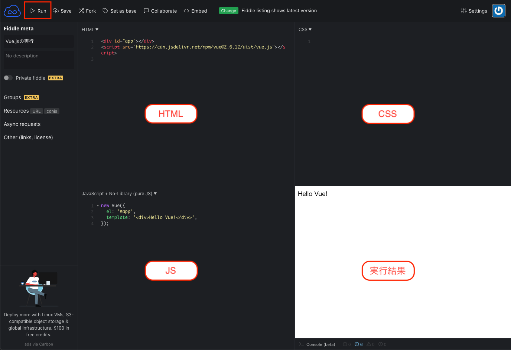

# 始めに（Vue.js編）
## Vue.jsとは？
JavaScriptのフレームワークで、Webアプリケーションのユーザーインターフェースを効率的に構築することを目的にしており、主にView部分を実装します。
他にも似たようなフレームワークがあり、以下のようなものが挙げられます。

+ React
+ Angular

これらのフレームワークの違いとしては学習が容易ということがあります。またドキュメントが充実しており、初心者には使いやすいとも言われています。

[Vue.js公式ドキュメント](https://jp.vuejs.org/v2/guide/)

## JS FiddleでVue.jsに触ってみる
簡単に触るだけならオンラインエディタを使うのが良く、ここでは[JS Fiddle](https://jsfiddle.net/)を使用します。こちらにアクセスして、HTMLとJavaScriptに以下のコードを入力してください。


```html
<div id="app"></div>
<script src="https://cdn.jsdelivr.net/npm/vue@2.6.12/dist/vue.js"></script>
```

```js
new Vue({
  el: '#app',
  template: '<div>Hello Vue!</div>',
});
```



上のメニューバーにある「Run」を押すと、右下のペインに「Hello Vue!」と表示されていると思います。
実際に書いたものが以下のものとなります。もし動かない場合はこちらを参考にしてください。

<iframe width="100%" height="300" src="//jsfiddle.net/wintyo/4dhtsnmj/embedded/result,js,html/" allowfullscreen="allowfullscreen" allowpaymentrequest frameborder="0"></iframe>


:::tip それぞれのオンラインエディタの特徴
JSFiddle以外にも有名なオンラインエディタはあり、JSFiddleも含めてメリットデメリット、使い所は以下のようになります。

**JSFiddle**

メリット
+ 2x2グリッドレイアウトがバランス良い

デメリット
+ CodePenと比べて機能が少ない
+ Qiitaに埋め込めない
  + ※iframeの埋め込みが可能なページは埋め込める

使い所
+ 本当にライトに使う場合にオススメ

**CodePen**

メリット
+ プリプロセッサが豊富
  + HTMLではpugが使用可能
+ Qiitaに埋め込める
+ APIが存在する

デメリット
+ ペインが少し狭い
  + 2x2グリッドレイアウトが存在しないため、HTML, CSS, JS全てを使うと狭くなってしまう

使い所
+ HTMLをpugで書きたいとき
+ Qiitaに埋め込むこと前提のとき

**CodeSandbox**

メリット
+ プロジェクトを作ることが出来る
  + npmパッケージをインストールして使うことができる

デメリット
+ 動作が重い、プレビューが動かないことがある
+ フォントがちょっと見辛い

使い所
+ packageインストールするレベルのものを作るとき
:::
